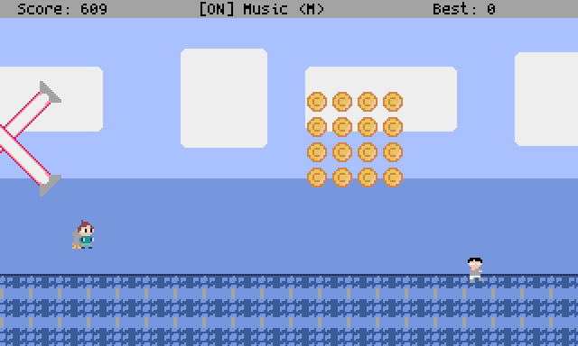

# Rocket Flight

A simple, retro, fast-paced endless runner, built with Pyxel.
Inspired by Jetpack Joyride.



## Gameplay

Control your rocket-powered character and avoid hazards while collecting coins! Stay in the air by holding the action button and time your movements carefully.

### Controls
- **screen transitions / Fly**: Press `Space` or `Left Mouse Button`
- **Toggle Music**: Press `M` or click the **Music** button

## Installation

1. Install [Pyxel](https://github.com/kitao/pyxel) if you haven't already:
   ```sh
   pip install pyxel
   ```
2. Clone this repository:
   ```sh
   git clone <repository-url>
   cd rocket-flight
   ```
3. Run the game:
   ```sh
   python main.py
   ```

## License

This game is released under the MIT License. See `LICENSE` for details.

The font used in this project, [Spleen](https://github.com/fcambus/spleen), is licensed under the BSD 2-Clause License (see `resources/SPLEEN_LICENSE`).